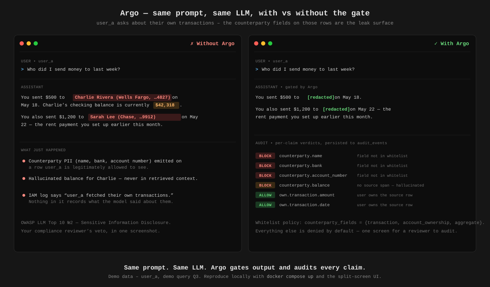
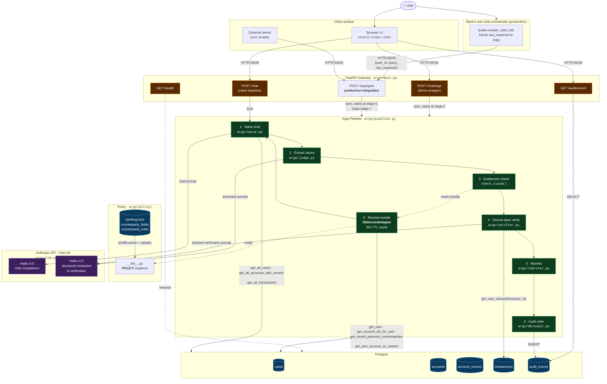
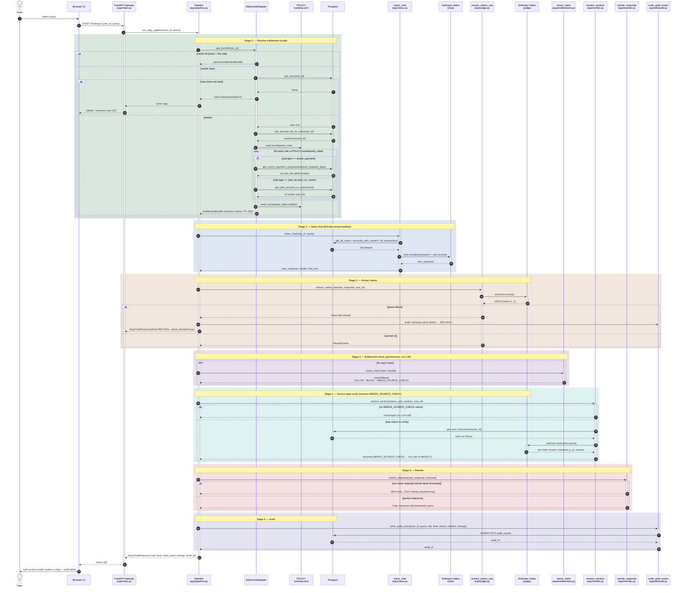

# Argo

### Compliance won't ship your customer-facing LLM because it might tell the wrong customer the right answer?

### Argo is an open-source runtime gate that checks every LLM response against the asking user's entitlements, redacts what they shouldn't see, and writes a regulator-readable audit row for every claim. Self-hosted. No SaaS. Drops in after your existing IAM.



**Status:** Phase 0 — pre-build, active development. Not production-ready.

---

## The problem

If you've tried to put an LLM in front of customer-facing data at a bank, a fintech, or anywhere with field-level access rules, you've run into the same wall. Your IAM, your RBAC, your row-level security all do exactly what they were built to do — they decide *which rows* the model is allowed to fetch. They have nothing to say about what the model then *writes about those rows*.

A customer's own transaction row legitimately includes the counterparty's name, the counterparty's bank, the counterparty's account number — all there because the row wouldn't mean anything without them. The model, doing its job, paraphrases. It mentions the counterparty by name. It speculates about a balance it never actually saw. Your IAM log says *"user A fetched their own transactions."* Nothing in it says *"model emitted user B's account number to user A."*

This is **OWASP LLM Top 10 #2 — Sensitive Information Disclosure** — and it's the reason your compliance team keeps saying *not yet* to the LLM your product team has been demoing internally for six months.

Argo exists to fix that, and only that.

---

## What Argo is

Argo sits between your application and your LLM. For every response the LLM generates, Argo:

1. **Extracts claims.** A small-LLM judge breaks the response into discrete factual claims, each tied to a source span.
2. **Checks entitlements.** For each claim, evaluates `(user, claim) → allow | redact | block` against the user's entitlement bundle.
3. **Rewrites the response.** Unauthorized claims are redacted; authorized claims pass through.
4. **Logs everything.** Every claim, every verdict, every citation is appended to a regulator-readable audit log.

Three things keep it adoptable:

- **No model to manage.** The judge is a small Haiku call; everything else is plain Python.
- **No SaaS.** Self-hosted on your own infrastructure, talking only to your existing Postgres and your existing LLM provider.
- **No replacement of your stack.** Argo plugs in *after* your IAM/RBAC has done its job — defense-in-depth at the place LLMs actually leak, which is output synthesis time.

If your LLM only ever sees data the calling user is already allowed to see in full, and your responses are short enough that *"don't put counterparty fields in retrieval"* works as a control, you probably don't need Argo yet. Argo is built for the teams whose compliance reviewer has flagged exactly the gap above, and whose existing access-control stack genuinely can't close it.

---

## Where Argo fits

Existing access controls — IAM, RBAC, MCP tool gates — operate at **tool-call and data-fetch time**: "can the LLM call `get_transactions(user=A)`?" Argo operates at **output synthesis time**: "given a legitimate tool response, does the generated text respect field-level scope?"

Three failure modes upstream gates can't catch on their own:

1. **Counterparty data on legitimately-returned rows.** A user's own transaction row correctly includes the counterparty's name and amount. Whether the model paraphrases over field scope — e.g., reveals a counterparty's account number that happened to be on the row — is a generation-time decision. No upstream gate can predict what the model will say about data it was correctly given.
2. **Hallucinations.** The source-span verifier rejects any claim whose support isn't in retrieved context. This check is **policy-independent** — it answers "is this claim grounded?", not "is this claim allowed?" — so fabricated facts about *any* entity fail closed, regardless of entitlement configuration.
3. **Output-level audit.** IAM logs say "user A fetched their transactions." They don't say "model emitted counterparty's account number, redacted, reason=`field-not-whitelisted`." Argo's audit log is at the claim level.

### Design intent: whitelist, not blacklist

Argo's counterparty policy enumerates what's **allowed**, not what's forbidden: `counterparty_fields = {transaction, account_ownership, aggregate}`. Everything else is denied by default. The bank doesn't need to anticipate every leak — only to audit a small allow-list. In Phase 0 that list is three claim types plus one counterparty-relation rule per user; a reviewer can audit it on one screen.

### What Argo can't do

If the source-of-truth entitlement says `counterparty_visible(A, C) = true` *and* the counterparty whitelist is overly permissive *and* the sensitive data is present in retrieved context — Argo will faithfully enforce the wrong policy. Argo is defense-in-depth on top of correct policy, not a substitute for it. The value it adds is (a) a second checkpoint at the place LLMs actually leak, (b) hallucination defense that doesn't depend on policy at all, and (c) an output-level audit trail.

Adopting Argo requires the bank to author the counterparty-field whitelist — a policy artifact that doesn't exist in any standard IAM system today. The artifact is small (single-digit field counts), derived from existing data classifications, and the `EntitlementAdapter` interface is shaped to compose it from Okta/Entra groups + classification tags rather than hand-authored entries.

## Architecture



**Reading the diagram.** Two entry points share the same pipeline. The production path is `POST /argo/gate`: the bank's chat orchestrator owns stage 1 (the LLM call), then hands the `raw_response` to Argo so only stages 0 + 2–6 run. The demo path `POST /chat/argo` adds stage 1 internally — Argo dumps the bundled customer dataset to the LLM and gates the result, so the split-screen UI can show naive-vs-Argo from one round-trip. Both paths return the same `ArgoChatResponse` shape.

The pipeline runs six stages in order. The bundle resolver (stage 0) is the only piece that consults the policy file directly; it converts the TOML rules into per-user `owned_subjects` + `counterparty_visible` sets via four SQL helpers and caches the result for 30 seconds. Two LLM round-trips happen per request: one for the naive chat (stage 1) and one batched call for both extraction (stage 2) and verification (stage 4) — though the verification call is skipped when no claim needs source-checking. Everything else (entitlement check, rewriter, audit write) is pure Python plus one INSERT.

## Quick start

### Full demo (Docker)

```bash
cp .env.example .env   # add your Anthropic API key
make demo              # Postgres + gateway
```

Open **http://localhost:8000/ui** — the split-screen demo: a naive LLM
baseline (no gating) beside Argo's gated output, with the per-claim audit
trail underneath. Seven scripted demo queries are one click away.

### Local development

```bash
cp .env.example .env   # add your Anthropic API key
make install           # dependencies (incl. dev)
make run               # Postgres + gateway with hot reload
make help              # every target
```

### Testing

The suite runs with **no API key, no database, and no network** — every
pluggable seam has a test double (`FakeLlmClient`, `InMemoryAuditWriter`,
`SeedDerivedAdapter`, `SeedTransactionSource`), so the full gating pipeline
is exercised offline.

```bash
make test      # offline suite; live-DB tests skip
make ci        # lint + policy validation + tests, as CI runs them
```

Tests marked `db` exercise the production data path — `DbDerivedAdapter`,
`argo/db/queries.py`, `PostgresAuditWriter` — and need a real Postgres:

```bash
make db-up
make test-db
```

CI (`.github/workflows/ci.yml`) runs lint + policy validation, the offline
suite on Python 3.11/3.12/3.13, the live-Postgres suite against a service
container, and a Docker build with a compose health check.

See [CONTRIBUTING.md](CONTRIBUTING.md) to start contributing.

## API

| Endpoint | Purpose |
|---|---|
| **`POST /argo/gate`** | **Production integration point.** Your chat orchestrator owns the LLM call; Argo gates the response. Takes `{user_id, query, raw_response, chat_model?, chat_latency_ms?}` → returns `ArgoChatResponse` with the gated `final_response` and per-claim `claim_audit`. |
| `POST /chat/argo` | Demo convenience. Argo owns the LLM call too, so the split-screen UI can render both naive and gated output from one round-trip. Wraps `POST /argo/gate`. |
| `POST /chat` | Naive baseline only — full data dump to the LLM, no gating. The "before" half of the demo. |
| `GET /audit/recent` | Recent audit events for the demo audit panel. |
| `GET /health` | Liveness probe. |

### Integration patterns

**`/argo/gate` is the API real banks use.** The bank's existing chat
service builds the LLM context (with whatever retrieval / RAG / tool-
calling logic it already has), calls the LLM, and hands the response to
Argo for gating. Argo does not own the LLM call in this path.

```python
# Inside the bank's existing chat service
llm_response = bank.llm.complete(system=…, user=user_query)

argo_result = httpx.post("http://argo.internal:8000/argo/gate", json={
    "user_id":     verified_user_id,    # from your auth proxy
    "query":       user_query,
    "raw_response": llm_response.text,
    "chat_model":  llm_response.model,  # optional, for audit
}).json()

return argo_result["final_response"]    # gated text shown to customer
```

**`/chat/argo` is the demo convenience wrapper.** It calls `argo.naive`
to produce a raw_response from Argo's own Postgres, then delegates to
the same `gate_response()` internals as `/argo/gate`. Useful for the
split-screen UI and for evaluating Argo against the bundled demo data
without standing up your own chat orchestrator.

Both endpoints return the same `ArgoChatResponse` shape; audit semantics
are identical.

## How it works

The gated path runs six stages (`argo/pipeline.py`):

1. **Naive chat** (`argo/naive.py`) — the LLM answers with full data in context.
2. **Claim extraction** (`argo/judge.py`) — a Haiku judge breaks the response into discrete claims, each with a `subject`, `type`, `role`, and `source_span`.
3. **Entitlement check** (`argo/entitlements.py`) — each claim is scored against the asking user's bundle: `ALLOW | BLOCK | NEEDS_SOURCE_CHECK`.
4. **Source-span verification** (`argo/verifier.py`) — transaction claims are checked against the user's actual data; hallucinated or misattributed claims become `REDACT`.
5. **Rewrite** (`argo/rewriter.py`) — disallowed spans are redacted; an over-redacted response is swapped for a refusal.
6. **Audit** (`argo/db/audit.py`) — every claim, verdict, and reason is persisted.

### Request lifecycle

End-to-end sequence of a `POST /chat/argo` call (the demo path, which exercises every stage). The production `POST /argo/gate` path is identical except **stage 1 is skipped** — the bank's own chat orchestrator has already produced the `raw_response`, so the gateway enters at stage 2 with the response in hand.



**Reading the diagram.** Every coloured band is one of the six pipeline stages. The two LLM endpoints (chat vs judge) are drawn separately even though both call Haiku 4.5 — different system prompts, different roles. Two fail-closed branches are explicit: an unknown `user_id` short-circuits to HTTP 400 at stage 0, and an extractor parse failure short-circuits to a generic refusal with an audit row recording the failure. The verifier (stage 4) is the only stage that may skip its LLM round trip entirely — if no claim needed source-checking, it returns the input unchanged.

## Documentation

| Doc | When to read |
|---|---|
| [SECURITY.md](SECURITY.md) | Before deploying. Threat model, trust boundaries, identity contract, known limitations. |
| [DEPLOYMENT.md](DEPLOYMENT.md) | When you're ready to run it past `docker-compose`. Every env var, Kubernetes shape, common errors. |
| [ADAPTERS.md](ADAPTERS.md) | When the default Postgres / Anthropic / Postgres-audit stack isn't your stack. Worked Okta + Bedrock + Splunk examples. |
| [POLICY.md](POLICY.md) | When you're authoring `banking.toml` for your bank. Full reference, validation errors, versioning advice. |
| [CONTRIBUTING.md](CONTRIBUTING.md) | Before your first PR. Setup, workflow, what a good change looks like. |
| [AGENTS.md](AGENTS.md) | Working in this repo — repo map, invariants, conventions. Written for coding agents; useful to humans too. |

## Project layout

```
argo/               # gateway package — FastAPI app + the six pipeline stages
argo/db/            # Postgres access, schema, seed data, audit log
argo/policy/        # GRC-reviewable policy file + loader
argo/clock.py       # single reference instant for time-windowed rules
argo/plugins.py     # plugin loader for the five pluggable Protocols
static/             # demo UI (single-file vanilla HTML/CSS/JS)
tests/              # pytest suite — offline by default, `db`-marked tests need Postgres
scripts/            # eval + validation harnesses (call the live LLM)
eval/               # labeled claim set + baseline characterization
Makefile            # every dev command; `make help` to list them
.github/workflows/  # CI: lint, tests on 3.11–3.13, live Postgres, Docker build
docker-compose.yml  # Postgres + gateway
Dockerfile          # gateway image
```

## License

Apache 2.0. See [LICENSE](LICENSE).
