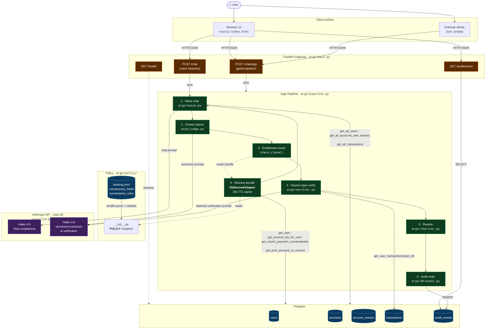
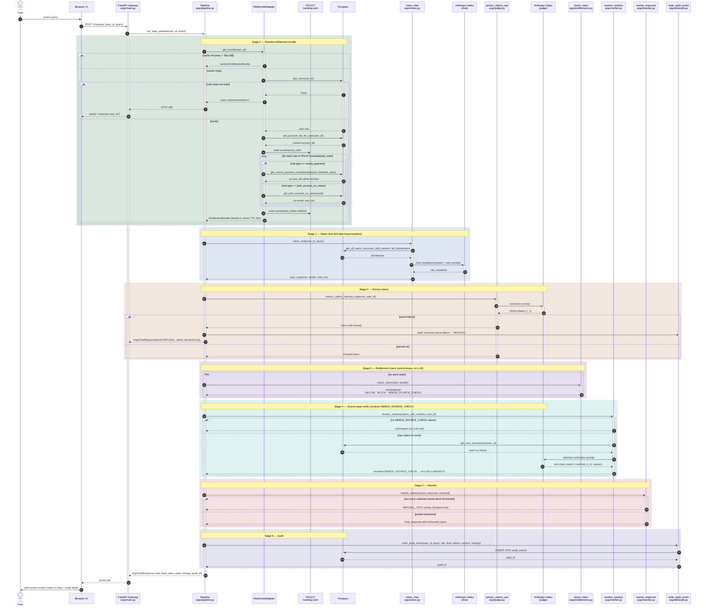

# Argo

The open-source runtime gate that stops your LLM from telling the wrong user the right answer.

**Status:** Phase 0 — pre-build, active development. Not production-ready.

## What it does

Argo sits between your application and your LLM. For every response the LLM generates, Argo:

1. **Extracts claims.** A small-LLM judge breaks the response into discrete factual claims, each tied to a source span.
2. **Checks entitlements.** For each claim, evaluates `(user, claim) → allow | redact | block` against the user's entitlement bundle.
3. **Rewrites the response.** Unauthorized claims are redacted; authorized claims pass through.
4. **Logs everything.** Every claim, every verdict, every citation is appended to a regulator-readable audit log.

Argo solves exactly **OWASP LLM Top 10 #2 — Sensitive Information Disclosure**. Nothing else.

## Where Argo fits

Existing access controls — IAM, RBAC, MCP tool gates — operate at **tool-call and data-fetch time**: "can the LLM call `get_transactions(user=A)`?" Argo operates at **output synthesis time**: "given a legitimate tool response, does the generated text respect field-level scope?"

Three failure modes upstream gates can't catch on their own:

1. **Counterparty data on legitimately-returned rows.** A user's own transaction row correctly includes the counterparty's name and amount. Whether the model paraphrases over field scope — e.g., reveals a counterparty's account number that happened to be on the row — is a generation-time decision. No upstream gate can predict what the model will say about data it was correctly given.
2. **Hallucinations.** The source-span verifier rejects any claim whose support isn't in retrieved context. This check is **policy-independent** — it answers "is this claim grounded?", not "is this claim allowed?" — so fabricated facts about *any* entity fail closed, regardless of entitlement configuration.
3. **Output-level audit.** IAM logs say "user A fetched their transactions." They don't say "model emitted counterparty's balance, redacted, reason=`field-not-whitelisted`." Argo's audit log is at the claim level.

### Design intent: whitelist, not blacklist

Argo's counterparty policy enumerates what's **allowed**, not what's forbidden: `counterparty_fields = {transaction, account_ownership, aggregate}`. Everything else is denied by default. The bank doesn't need to anticipate every leak — only to audit a small allow-list. In Phase 0 that list is three claim types plus one counterparty-relation rule per user; a reviewer can audit it on one screen.

### What Argo can't do

If the source-of-truth entitlement says `counterparty_visible(A, C) = true` *and* the counterparty whitelist is overly permissive *and* the sensitive data is present in retrieved context — Argo will faithfully enforce the wrong policy. Argo is defense-in-depth on top of correct policy, not a substitute for it. The value it adds is (a) a second checkpoint at the place LLMs actually leak, (b) hallucination defense that doesn't depend on policy at all, and (c) an output-level audit trail.

Adopting Argo requires the bank to author the counterparty-field whitelist — a policy artifact that doesn't exist in any standard IAM system today. The artifact is small (single-digit field counts), derived from existing data classifications, and the `EntitlementAdapter` interface is shaped to compose it from Okta/Entra groups + classification tags rather than hand-authored entries.

## Architecture



**Reading the diagram.** A request enters the FastAPI gateway at `POST /chat/argo` and the pipeline runs six stages in order. The bundle resolver (stage 0) is the only piece that consults the policy file directly; it converts the TOML rules into per-user `owned_subjects` + `counterparty_visible` sets via four SQL helpers and caches the result for 30 seconds. Two LLM round-trips happen per request: one for the naive chat (stage 1) and one batched call for both extraction (stage 2) and verification (stage 4) — though the verification call is skipped when no claim needs source-checking. Everything else (entitlement check, rewriter, audit write) is pure Python plus one INSERT.

## Quick start

### Full demo (Docker)

```bash
cp .env.example .env          # add your Anthropic API key
docker compose up -d --build  # Postgres + gateway
```

Open **http://localhost:8000/ui** — the split-screen demo: a naive LLM
baseline (no gating) beside Argo's gated output, with the per-claim audit
trail underneath. Seven scripted demo queries are one click away.

### Local development

```bash
docker compose up -d postgres   # Postgres only
cp .env.example .env            # add your Anthropic API key
uv sync                         # install dependencies (incl. dev)
uv run uvicorn argo.main:app --reload
uv run pytest                   # run the test suite
```

## API

| Endpoint | Purpose |
|---|---|
| `POST /chat` | Naive baseline — full data dump to the LLM, no gating. The "before" half of the demo. |
| `POST /chat/argo` | Gated path — extract → entitlement-check → source-verify → rewrite → audit. |
| `GET /audit/recent` | Recent audit events for the audit panel. |
| `GET /health` | Liveness probe. |

## How it works

The gated path runs six stages (`argo/pipeline.py`):

1. **Naive chat** (`argo/naive.py`) — the LLM answers with full data in context.
2. **Claim extraction** (`argo/judge.py`) — a Haiku judge breaks the response into discrete claims, each with a `subject`, `type`, `role`, and `source_span`.
3. **Entitlement check** (`argo/entitlements.py`) — each claim is scored against the asking user's bundle: `ALLOW | BLOCK | NEEDS_SOURCE_CHECK`.
4. **Source-span verification** (`argo/verifier.py`) — transaction claims are checked against the user's actual data; hallucinated or misattributed claims become `REDACT`.
5. **Rewrite** (`argo/rewriter.py`) — disallowed spans are redacted; an over-redacted response is swapped for a refusal.
6. **Audit** (`argo/db/audit.py`) — every claim, verdict, and reason is persisted.

### Request lifecycle

End-to-end sequence of a `POST /chat/argo` call, including every external round trip and the cache / fail-closed branches:



**Reading the diagram.** Every coloured band is one of the six pipeline stages. The two LLM endpoints (chat vs judge) are drawn separately even though both call Haiku 4.5 — different system prompts, different roles. Two fail-closed branches are explicit: an unknown `user_id` short-circuits to HTTP 400 at stage 0, and an extractor parse failure short-circuits to a generic refusal with an audit row recording the failure. The verifier (stage 4) is the only stage that may skip its LLM round trip entirely — if no claim needed source-checking, it returns the input unchanged.

## Project layout

```
argo/               # gateway package — FastAPI app + the six pipeline stages
argo/db/            # Postgres access, schema, seed data, audit log
static/             # demo UI (single-file vanilla HTML/CSS/JS)
tests/              # pytest suite (entitlement policy + rewriter)
scripts/            # eval + validation harnesses
eval/               # labeled claim set + baseline characterization
docker-compose.yml  # Postgres + gateway
Dockerfile          # gateway image
```

## License

Apache 2.0. See [LICENSE](LICENSE).
